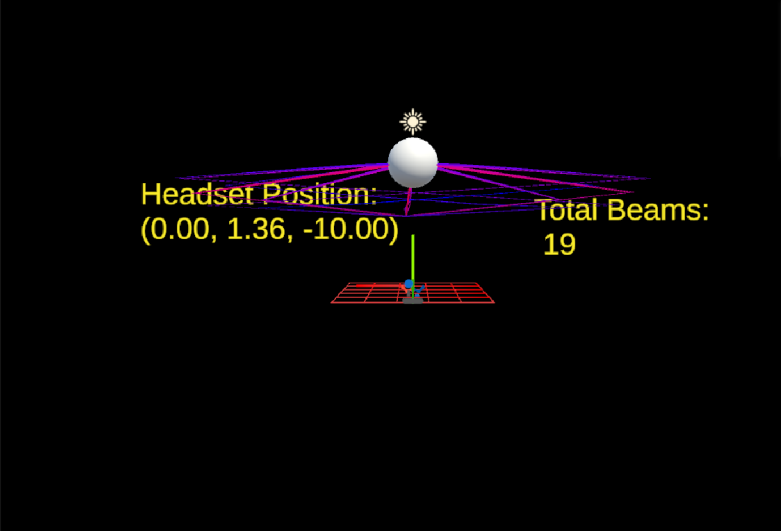
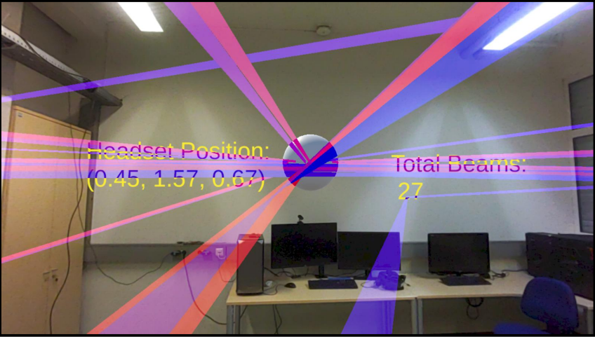
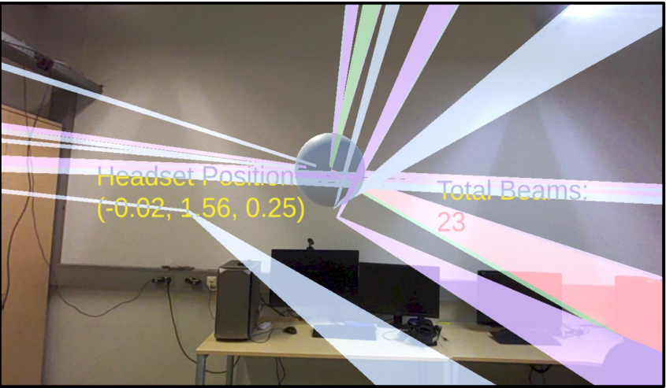

# Real-Time Adaptive XR Spatial Visualization Framework  
### Immersive Spatial Rendering Architecture for Interactive Simulation

> Adaptive XR spatial rendering architecture for immersive historical environments.

## Overview

This project presents a real-time adaptive spatial visualization framework developed in Unityusing OpenXR.

The system dynamically regenerates spatial trajectories based on live headset movement and controller-driven interaction layers. It demonstrates how simulation data can be transformed into immersive, responsive environments.

While originally applied to electromagnetic propagation modeling, the underlying architecture is domain-agnostic and adaptable to cultural heritage simulation, spatial storytelling, and experiential learning contexts.

---

## Architectural Concept

Simulation Data (MATLAB)  
→ Structured Spatial Coordinates (CSV)  
→ Unity Runtime Processing  
→ OpenXR Headset Tracking  
→ Adaptive Line Rendering  

The immersive layer continuously recalculates the nearest spatial receiver based on user position, dynamically rebuilding rendered trajectories in real time.

---

## Core System Capabilities

- Dense spatial receiver grid (1000+ positions)
- Real-time headset-driven spatial recalculation
- Multi-layer interaction cycling (direct → progressive interaction levels)
- Runtime object cleanup for performance optimization
- Simulation-to-world coordinate transformation
- Color-coded interaction states for perceptual clarity

---

## Demonstration

🎥 Watch the system in action:  
https://drive.google.com/file/d/1ASZKajbqx4IUjeUizC_rteoIlfDFqhu5/view?usp=drive_link

---

## Visual Preview

### Unity Runtime Environment

### Headset-Level Adaptive Rendering

### Progressive Multi-Interaction Visualization

---

## Cultural & Heritage Adaptation Potential

This adaptive XR architecture can be extended to:

- Cathedral light and acoustic propagation simulation  
- Medieval fortification line-of-sight mapping  
- Archaeological spatial reconstruction  
- Historical battlefield visibility modeling  
- Trade route immersion and narrative layering  

The framework is designed not as a domain-specific tool, but as a reusable immersive spatial engine.

---

## Repository Contents

- `beamscript.cs` — Unity runtime rendering and interaction logic

- Technical documentation available upon request
